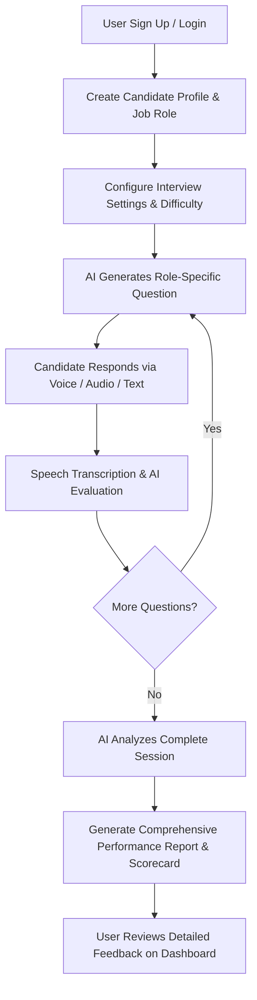

# 🎙️ AI Interviewer - Intelligent Mock Interview Platform

[](https://react.dev/)
[](https://vitejs.dev/)
[](https://nodejs.org/)
[](https://www.mongodb.com/)
[](https://tailwindcss.com/)
[](https://ai.google.dev/)
[](https://openai.com/)

**AI Interviewer** is a full-stack, AI-powered mock interview platform designed to simulate realistic technical and behavioral job interviews. With conversational voice interactions, real-time response evaluation, adaptive question generation, and comprehensive post-interview analytical scorecards, it empowers job seekers to practice, refine their communication, and master their interview skills.

---

## 🌟 Key Features

- 🎯 **Adaptive AI Question Generation**: Dynamically crafts role-specific, difficulty-tiered questions tailored to the candidate's target job title, experience level, and tech stack.
- 🎙️ **Voice & Audio Interaction**: Real-time microphone recording and audio transcription via Whisper & Gemini models, combined with Text-to-Speech (TTS) for natural conversational back-and-forth.
- ⚡ **Real-Time Evaluation Engine**: Assesses candidate responses per question on technical accuracy, clarity, problem-solving approach, and relevance.
- 📊 **Comprehensive Performance Reports**: Delivers post-interview analytical summaries featuring overall scores, category breakdown (Communication, Technical, Logic), strengths, areas for improvement, and actionable tips.
- 🔐 **Secure Authentication & OAuth**: Full-featured JWT and cookie-based authentication with **Google OAuth 2.0** and **GitHub OAuth** social login integration.
- 💳 **Monetization & Credit System**: Integrated **Razorpay** payment gateway for credit recharges and premium interview packages.
- 🎨 **Modern Glassmorphic UI**: Highly responsive interface built with React 19, Tailwind CSS v4, Lucide icons, and dark-themed aesthetics.

---

## 🛠️ Tech Stack

### Frontend
- **Framework**: [React 19](https://react.dev/) + [Vite](https://vitejs.dev/)
- **Styling**: [Tailwind CSS v4](https://tailwindcss.com/)
- **Routing**: [React Router DOM v7](https://reactrouter.com/)
- **Icons**: [Lucide React](https://lucide.dev/)
- **HTTP Client**: [Axios](https://axios-http.com/)
- **Payments**: Razorpay Checkout SDK

### Backend
- **Runtime & Framework**: [Node.js](https://nodejs.org/) & [Express.js (v5)](https://expressjs.com/) (ES Modules)
- **Database**: [MongoDB](https://www.mongodb.com/) via [Mongoose 9](https://mongoosejs.com/)
- **Authentication**: Passport.js (Google OAuth 2.0, GitHub Strategy), JWT (`jsonwebtoken`), `bcryptjs`, `cookie-parser`
- **AI & Speech Services**:
  - Google Gemini API (`@google/genai`)
  - OpenAI API (`openai`) for transcription and evaluation
- **File Uploads**: `multer` (audio buffer handling)
- **Payments**: `razorpay` Node SDK

---

## 📂 Project Architecture

```plaintext
AI-Interviewer/
├── Backend/
│   ├── config/              # MongoDB connection & Passport.js strategy configs
│   ├── controllers/         # Request handlers (auth, candidate, interview, payment)
│   ├── middlewares/         # JWT verification, auth guards, upload handlers
│   ├── models/              # Mongoose schemas (User, Candidate, Interview, Report, Payment, etc.)
│   ├── routes/              # Express API route declarations
│   ├── services/            # AI services (Prompt builder, Question gen, Transcription, Reports)
│   ├── index.js             # Express server entry point
│   └── package.json
│
├── Frontend/
│   ├── src/
│   │   ├── assets/          # Static assets & icons
│   │   ├── components/      # Reusable UI components (Navbar, Modal, AudioPlayer, etc.)
│   │   ├── context/         # AuthContext and global application states
│   │   ├── hooks/           # Custom React hooks (Audio recorder, speech, timers)
│   │   ├── pages/           # Application views
│   │   │   ├── LandingPage.jsx          # Public landing & feature showcase
│   │   │   ├── LoginPage.jsx            # User login & social auth
│   │   │   ├── RegisterPage.jsx         # User registration
│   │   │   ├── DashboardPage.jsx        # Candidate hub & interview history
│   │   │   ├── NewInterviewPage.jsx     # Interview configuration & candidate details
│   │   │   ├── InterviewSessionPage.jsx # Real-time voice/text interview session
│   │   │   ├── ReportsListPage.jsx      # Historical reports overview
│   │   │   └── ReportPage.jsx           # Detailed analytical scorecard
│   │   ├── utils/           # Helper utilities & Razorpay payment triggers
│   │   ├── App.jsx          # App layout & route definitions
│   │   └── main.jsx         # Frontend React entry point
│   ├── package.json
│   └── vite.config.js
└── README.md
```

---

## 🚀 Getting Started

### Prerequisites

Ensure you have the following installed on your machine:
- [Node.js](https://nodejs.org/) (v18+ recommended)
- [MongoDB](https://www.mongodb.com/) (Local instance or [MongoDB Atlas](https://www.mongodb.com/atlas))
- API Keys for:
  - Google Gemini API or OpenAI API
  - Google Cloud Console & GitHub Developer Apps (for OAuth, optional in local testing)
  - Razorpay Test Account (for payment integration)

---

### 1. Clone the Repository

```bash
git clone https://github.com/ArmaanJaswal/Ai-Interviewer.git
cd Ai-Interviewer
```

---

### 2. Backend Setup

1. Navigate to the backend directory:
   ```bash
   cd Backend
   ```
2. Install dependencies:
   ```bash
   npm install
   ```
3. Create a `.env` file in the `Backend/` directory:
   ```env
   PORT=5000
   MONGO_URI=mongodb://localhost:27017/ai-interviewer
   CLIENT_URL=http://localhost:5173
   JWT_SECRET=your_super_secret_jwt_key

   # AI Services
   GEMINI_API_KEY=your_google_gemini_api_key
   OPENAI_API_KEY=your_openai_api_key

   # OAuth Providers (Optional for local testing)
   GOOGLE_CLIENT_ID=your_google_client_id
   GOOGLE_CLIENT_SECRET=your_google_client_secret
   GOOGLE_CALLBACK_URL=http://localhost:5000/api/auth/google/callback

   GITHUB_CLIENT_ID=your_github_client_id
   GITHUB_CLIENT_SECRET=your_github_client_secret
   GITHUB_CALLBACK_URL=http://localhost:5000/api/auth/github/callback

   # Payment Gateway (Razorpay)
   RAZORPAY_KEY_ID=your_razorpay_key_id
   RAZORPAY_KEY_SECRET=your_razorpay_key_secret
   ```
4. Start the backend development server:
   ```bash
   npm run dev
   ```
   The backend server should now be running on `http://localhost:5000`.

---

### 3. Frontend Setup

1. Open a new terminal and navigate to the frontend directory:
   ```bash
   cd Frontend
   ```
2. Install dependencies:
   ```bash
   npm install
   ```
3. Create a `.env` file in the `Frontend/` directory:
   ```env
   VITE_API_BASE_URL=http://localhost:5000
   VITE_RAZORPAY_KEY_ID=your_razorpay_key_id
   ```
4. Start the frontend development server:
   ```bash
   npm run dev
   ```
   Open your browser and navigate to `http://localhost:5173`.

---

## 📡 API Endpoints Overview

| Method | Endpoint | Description | Protected |
| :--- | :--- | :--- | :---: |
| `POST` | `/api/auth/register` | Register new user account | No |
| `POST` | `/api/auth/login` | Login user & return session JWT | No |
| `GET` | `/api/auth/me` | Fetch authenticated user profile | Yes |
| `GET` | `/api/auth/logout` | Clear auth cookies & logout | Yes |
| `GET` | `/api/auth/google` | Google OAuth initialization | No |
| `GET` | `/api/auth/github` | GitHub OAuth initialization | No |
| `POST` | `/api/candidate/` | Save / update candidate profile & tech preferences | Yes |
| `POST` | `/api/interview/start` | Initialize interview session & generate 1st question | Yes |
| `POST` | `/api/interview/answer` | Submit answer (audio / text) & get AI evaluation | Yes |
| `POST` | `/api/interview/complete` | Complete interview & trigger report generation | Yes |
| `GET` | `/api/interview/report/:id` | Fetch detailed performance scorecard & analytics | Yes |
| `POST` | `/api/payment/order` | Create Razorpay payment order for credits | Yes |
| `POST` | `/api/payment/verify` | Verify payment signature & credit user balance | Yes |

---

## 🔄 Interview Workflow



---

## 🛣️ Roadmap & Future Enhancements

- [ ] **Live Video & Emotion Proctoring**: Facial expression and eye-contact assessment using computer vision.
- [ ] **Automated Resume Parser**: PDF/Docx upload that auto-fills tech stack, projects, and custom interview tracks.
- [ ] **Multi-Language Support**: Practice interviews in multiple languages with locale-specific accents.
- [ ] **Recruiter Dashboard**: Allow companies to send interview links and review candidate AI scorecards.
- [ ] **Coding Sandbox**: Live in-browser code editor with AI unit test validation during technical interviews.

---

## 🤝 Contributing

Contributions, issues, and feature requests are welcome!

1. Fork the Project
2. Create your Feature Branch (`git checkout -b feature/AmazingFeature`)
3. Commit your Changes (`git commit -m 'Add some AmazingFeature'`)
4. Push to the Branch (`git push origin feature/AmazingFeature`)
5. Open a Pull Request

---

## 📄 License

Distributed under the ISC License. See `LICENSE` for more information.

---

## 👤 Author

**Armaan Jaswal**
- GitHub: [@ArmaanJaswal](https://github.com/ArmaanJaswal)
